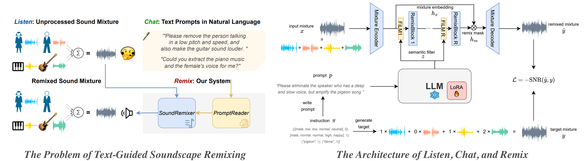

by ***Xilin Jiang, Cong Han, Yinghao Aaron Li*** and ***Nima Mesgarani***

from ***Columbia University, New York, USA***

**Abstract** In daily life, we encounter a variety of sounds, both desirable and undesirable, with limited control over their presence and volume. Our work introduces “Listen, Chat, and Remix” (LCR), a novel multimodal sound remixer that controls each sound source in a mixture based on user-provided text instructions. LCR distinguishes itself with a user-friendly text interface and its unique ability to remix multiple sound sources simultaneously within a mixture, without needing to separate them. Users input open-vocabulary text prompts, which are interpreted by a large language model to create a semantic filter for remixing the sound mixture. The system then decomposes the mixture into its components, applies the semantic filter, and reassembles filtered components back to the desired output. We developed a 160-hour dataset with over 100k mixtures, including speech and various audio sources, along with text prompts for diverse remixing tasks including extraction, removal, and volume control of single or multiple sources. Our experiments demonstrate significant improvements in signal quality across all remixing tasks and robust performance in zero-shot scenarios with varying numbers and types of sound sources.

This page contains a set of audio samples. We write 4~6 text prompts for each sample and show the remixed sound mixture according to each text prompt. We recommend opening this website with Chrome and wearing headphones for the best audio experience.

### Sound Mixture Compositions
Only the “2 Speech + 2 Audio (VGGSound)” composition is used for training. All other compositions all zero-shot.

  
2 Speech + 2 Audio (VGGSound)▶

  

<table>
    <tbody>
        <tr>
        <th style="text-align: left;">🔉Input Mixture #1 consists of </th>
        <td style="text-align: center;">female speaker with high pitch, normal tempo, high energy, and neutral emotion</td>
        <td style="text-align: center;">male speaker with low pitch, high tempo, normal energy, and neutral emotion</td>
        <td style="text-align: center;">helicopter</td>
        <td style="text-align: center;">turkey gobbling</td>
        </tr>
        <tr>
        <td style="width: 20%;">
            <audio controls>
                <source src="../wavs/2Speech2Audio/ex1/mix.wav" type="audio/wav">
                Your browser does not support the audio element.
            </audio>
        </td>
        <td style="width: 20%;">
            <audio controls>
                <source src="../wavs/2Speech2Audio/ex1/s0.wav" type="audio/wav">
                Your browser does not support the audio element.
            </audio>
        </td>
        <td style="width: 20%;">
            <audio controls>
                <source src="../wavs/2Speech2Audio/ex1/s1.wav" type="audio/wav">
                Your browser does not support the audio element.
            </audio>
        </td>
        <td style="width: 20%;">
            <audio controls>
                <source src="../wavs/2Speech2Audio/ex1/s2.wav" type="audio/wav">
                Your browser does not support the audio element.
            </audio>
        </td>
        <td style="width: 20%;">
            <audio controls>
                <source src="../wavs/2Speech2Audio/ex1/s3.wav" type="audio/wav">
                Your browser does not support the audio element.
            </audio>
        </td>
        </tr>
    </tbody>
</table>

<table>
    <tr>
        <td colspan="2" style="text-align: left; width: 50%;">✏️"Increase the volume of the speeches and decrease the volume of the background sounds."</td>
        <td colspan="2" style="text-align: left; width: 50%;">✏️"Let's pull out the sound of the fast-talking man and the turkey."</td>
    </tr>
    <tr>
        <th style="width: 25%; text-align: left;">✨Remixed Mixture A</th>
        <th style="width: 25%; text-align: left;">Target Mixture A</th>
        <th style="width: 25%; text-align: left;">✨Remixed Mixture B</th>
        <th style="width: 25%; text-align: left;">Target Mixture B</th>
    </tr>
    <tr>
        <td style="width: 25%;">
            <audio controls>
                <source src="../wavs/2Speech2Audio/ex1/edit_UUDD.wav" type="audio/wav">
                Your browser does not support the audio element.
            </audio>
        </td>
        <td style="width: 25%;">
            <audio controls><source src="../wavs/2Speech2Audio/ex1/tar_UUDD.wav" type="audio/wav">
                Your browser does not support the audio element.
            </audio>
        </td>
        <td style="width: 25%;">
            <audio controls>
                <source src="../wavs/2Speech2Audio/ex1/edit_0101.wav" type="audio/wav">
                Your browser does not support the audio element.
            </audio>
        </td>
        <td style="width: 25%;">
            <audio controls><source src="../wavs/2Speech2Audio/ex1/tar_0101.wav" type="audio/wav">
                Your browser does not support the audio element.
            </audio>
        </td>
    </tr>
    <tr>
        <td colspan="2" style="text-align: left; width: 50%;">✏️"Remove all people talking."</td>
        <td colspan="2" style="text-align: left; width: 50%;">✏️"Why not get rid of the man's voice and the turkey's noise, and reduce the helicopter's volume?"</td>
    </tr>
    <tr>
        <th style="width: 25%; text-align: left;">✨Remixed Mixture C</th>
        <th style="width: 25%; text-align: left;">Target Mixture C</th>
        <th style="width: 25%; text-align: left;">✨Remixed Mixture D</th>
        <th style="width: 25%; text-align: left;">Target Mixture D</th>
    </tr>
    <tr>
        <td style="width: 25%;">
            <audio controls>
                <source src="../wavs/2Speech2Audio/ex1/edit_0011.wav" type="audio/wav">
                Your browser does not support the audio element.
            </audio>
        </td>
        <td style="width: 25%;">
            <audio controls><source src="../wavs/2Speech2Audio/ex1/tar_0011.wav" type="audio/wav">
                Your browser does not support the audio element.
            </audio>
        </td>
        <td style="width: 25%;">
            <audio controls>
                <source src="../wavs/2Speech2Audio/ex1/edit_10D0.wav" type="audio/wav">
                Your browser does not support the audio element.
            </audio>
        </td>
        <td style="width: 25%;">
            <audio controls><source src="../wavs/2Speech2Audio/ex1/tar_10D0.wav" type="audio/wav">
                Your browser does not support the audio element.
            </audio>
        </td>
    </tr>
    <tr>
        <td colspan="2" style="text-align: left; width: 50%;">✏️"Could you kindly eliminate the sound of the helicopter? I appreciate it."</td>
        <td colspan="2" style="text-align: left; width: 50%;">✏️"Please extract the person with an elevated tone."</td>
    </tr>
    <tr>
        <th style="width: 25%; text-align: left;">✨Remixed Mixture E</th>
        <th style="width: 25%; text-align: left;">Target Mixture E</th>
        <th style="width: 25%; text-align: left;">✨Remixed Mixture F</th>
        <th style="width: 25%; text-align: left;">Target Mixture F</th>
    </tr>
    <tr>
        <td style="width: 25%;">
            <audio controls>
                <source src="../wavs/2Speech2Audio/ex1/edit_1101.wav" type="audio/wav">
                Your browser does not support the audio element.
            </audio>
        </td>
        <td style="width: 25%;">
            <audio controls><source src="../wavs/2Speech2Audio/ex1/tar_1101.wav" type="audio/wav">
                Your browser does not support the audio element.
            </audio>
        </td>
        <td style="width: 25%;">
            <audio controls>
                <source src="../wavs/2Speech2Audio/ex1/edit_1000.wav" type="audio/wav">
                Your browser does not support the audio element.
            </audio>
        </td>
        <td style="width: 25%;">
            <audio controls><source src="../wavs/2Speech2Audio/ex1/tar_1000.wav" type="audio/wav">
                Your browser does not support the audio element.
            </audio>
        </td>
    </tr>
</table>

<table>
    <tbody>
        <tr>
        <th style="text-align: left;">🔉Input Mixture #2 consists of </th>
        <td style="text-align: center;">male speaker with low pitch, low tempo, low energy, and sad emotion</td>
        <td style="text-align: center;">female speaker with high pitch, normal tempo, normal energy, and neutral emotion</td>
        <td style="text-align: center;">playing accordion</td>
        <td style="text-align: center;">playing drum kit</td>
        </tr>
        <tr>
        <td style="width: 20%;">
            <audio controls>
                <source src="../wavs/2Speech2Audio/ex2/mix.wav" type="audio/wav">
                Your browser does not support the audio element.
            </audio>
        </td>
        <td style="width: 20%;">
            <audio controls>
                <source src="../wavs/2Speech2Audio/ex2/s0.wav" type="audio/wav">
                Your browser does not support the audio element.
            </audio>
        </td>
        <td style="width: 20%;">
            <audio controls>
                <source src="../wavs/2Speech2Audio/ex2/s1.wav" type="audio/wav">
                Your browser does not support the audio element.
            </audio>
        </td>
        <td style="width: 20%;">
            <audio controls>
                <source src="../wavs/2Speech2Audio/ex2/s2.wav" type="audio/wav">
                Your browser does not support the audio element.
            </audio>
        </td>
        <td style="width: 20%;">
            <audio controls>
                <source src="../wavs/2Speech2Audio/ex2/s3.wav" type="audio/wav">
                Your browser does not support the audio element.
            </audio>
        </td>
        </tr>
    </tbody>
</table>

<table>
    <tr>
        <td colspan="2" style="text-align: left; width: 50%;">✏️"Is it possible to single out the accordion's performance?"</td>
        <td colspan="2" style="text-align: left; width: 50%;">✏️"Lower the volume of the live accordion music that is currently being played, please."</td>
    </tr>
    <tr>
        <th style="width: 25%; text-align: left;">✨Remixed Mixture A</th>
        <th style="width: 25%; text-align: left;">Target Mixture A</th>
        <th style="width: 25%; text-align: left;">✨Remixed Mixture B</th>
        <th style="width: 25%; text-align: left;">Target Mixture B</th>
    </tr>
    <tr>
        <td style="width: 25%;">
            <audio controls>
                <source src="../wavs/2Speech2Audio/ex2/edit_0010.wav" type="audio/wav">
                Your browser does not support the audio element.
            </audio>
        </td>
        <td style="width: 25%;">
            <audio controls><source src="../wavs/2Speech2Audio/ex2/tar_0010.wav" type="audio/wav">
                Your browser does not support the audio element.
            </audio>
        </td>
        <td style="width: 25%;">
            <audio controls>
                <source src="../wavs/2Speech2Audio/ex2/edit_11D1.wav" type="audio/wav">
                Your browser does not support the audio element.
            </audio>
        </td>
        <td style="width: 25%;">
            <audio controls><source src="../wavs/2Speech2Audio/ex2/tar_11D1.wav" type="audio/wav">
                Your browser does not support the audio element.
            </audio>
        </td>
    </tr>
    <tr>
        <td colspan="2" style="text-align: left; width: 50%;">✏️"Could you raise the decibel level of the gloomy speaker that has a subdued tone?"</td>
        <td colspan="2" style="text-align: left; width: 50%;">✏️"Please raise the sound for the
            female speaker with a standard tempo, amplify the playing accordion, reduce the playing drum kit, and decrease the volume for the male speaker with a sluggish pace."</td>
    </tr>
    <tr>
        <th style="width: 25%; text-align: left;">✨Remixed Mixture C</th>
        <th style="width: 25%; text-align: left;">Target Mixture C</th>
        <th style="width: 25%; text-align: left;">✨Remixed Mixture D</th>
        <th style="width: 25%; text-align: left;">Target Mixture D</th>
    </tr>
    <tr>
        <td style="width: 25%;">
            <audio controls>
                <source src="../wavs/2Speech2Audio/ex2/edit_U111.wav" type="audio/wav">
                Your browser does not support the audio element.
            </audio>
        </td>
        <td style="width: 25%;">
            <audio controls><source src="../wavs/2Speech2Audio/ex2/tar_U111.wav" type="audio/wav">
                Your browser does not support the audio element.
            </audio>
        </td>
        <td style="width: 25%;">
            <audio controls>
                <source src="../wavs/2Speech2Audio/ex2/edit_DUUD.wav" type="audio/wav">
                Your browser does not support the audio element.
            </audio>
        </td>
        <td style="width: 25%;">
            <audio controls><source src="../wavs/2Speech2Audio/ex2/tar_DUUD.wav" type="audio/wav">
                Your browser does not support the audio element.
            </audio>
        </td>
    </tr>
    <tr>
        <td colspan="2" style="text-align: left; width: 50%;">✏️"I'd like you to exclude the speaker with a high-frequency voice and average vitality, conveying a neutral tone."</td>
        <td colspan="2" style="text-align: left; width: 50%;">✏️"Make everything quieter."</td>
    </tr>
    <tr>
        <th style="width: 25%; text-align: left;">✨Remixed Mixture E</th>
        <th style="width: 25%; text-align: left;">Target Mixture E</th>
        <th style="width: 25%; text-align: left;">✨Remixed Mixture F</th>
        <th style="width: 25%; text-align: left;">Target Mixture F</th>
    </tr>
    <tr>
        <td style="width: 25%;">
            <audio controls>
                <source src="../wavs/2Speech2Audio/ex2/edit_1011.wav" type="audio/wav">
                Your browser does not support the audio element.
            </audio>
        </td>
        <td style="width: 25%;">
            <audio controls><source src="../wavs/2Speech2Audio/ex2/tar_1011.wav" type="audio/wav">
                Your browser does not support the audio element.
            </audio>
        </td>
        <td style="width: 25%;">
            <audio controls>
                <source src="../wavs/2Speech2Audio/ex2/edit_DDDD.wav" type="audio/wav">
                Your browser does not support the audio element.
            </audio>
        </td>
        <td style="width: 25%;">
            <audio controls><source src="../wavs/2Speech2Audio/ex2/tar_DDDD.wav" type="audio/wav">
                Your browser does not support the audio element.
            </audio>
        </td>
    </tr>
</table>

<table>
    <tbody>
        <tr>
        <th style="text-align: left;">🔉Input Mixture #3 consists of </th>
        <td style="text-align: center;">male speaker with low pitch, normal tempo, normal energy, and neutral emotion</td>
        <td style="text-align: center;">male speaker with low pitch, high tempo, normal energy, and neutral emotion</td>
        <td style="text-align: center;">underwater bubbling</td>
        <td style="text-align: center;">train horning</td>
        </tr>
        <tr>
        <td style="width: 20%;">
            <audio controls>
                <source src="../wavs/2Speech2Audio/ex3/mix.wav" type="audio/wav">
                Your browser does not support the audio element.
            </audio>
        </td>
        <td style="width: 20%;">
            <audio controls>
                <source src="../wavs/2Speech2Audio/ex3/s0.wav" type="audio/wav">
                Your browser does not support the audio element.
            </audio>
        </td>
        <td style="width: 20%;">
            <audio controls>
                <source src="../wavs/2Speech2Audio/ex3/s1.wav" type="audio/wav">
                Your browser does not support the audio element.
            </audio>
        </td>
        <td style="width: 20%;">
            <audio controls>
                <source src="../wavs/2Speech2Audio/ex3/s2.wav" type="audio/wav">
                Your browser does not support the audio element.
            </audio>
        </td>
        <td style="width: 20%;">
            <audio controls>
                <source src="../wavs/2Speech2Audio/ex3/s3.wav" type="audio/wav">
                Your browser does not support the audio element.
            </audio>
        </td>
        </tr>
    </tbody>
</table>

<table>
    <tr>
        <td colspan="2" style="text-align: left; width: 50%;">✏️"Enhance this recording by removing all the noises."</td>
        <td colspan="2" style="text-align: left; width: 50%;">✏️"Could you raise the audio level of the underwater bubbling sound exclusively?"</td>
    </tr>
    <tr>
        <th style="width: 25%; text-align: left;">✨Remixed Mixture A</th>
        <th style="width: 25%; text-align: left;">Target Mixture A</th>
        <th style="width: 25%; text-align: left;">✨Remixed Mixture B</th>
        <th style="width: 25%; text-align: left;">Target Mixture B</th>
    </tr>
    <tr>
        <td style="width: 25%;">
            <audio controls>
                <source src="../wavs/2Speech2Audio/ex3/edit_1100.wav" type="audio/wav">
                Your browser does not support the audio element.
            </audio>
        </td>
        <td style="width: 25%;">
            <audio controls><source src="../wavs/2Speech2Audio/ex3/tar_1100.wav" type="audio/wav">
                Your browser does not support the audio element.
            </audio>
        </td>
        <td style="width: 25%;">
            <audio controls>
                <source src="../wavs/2Speech2Audio/ex3/edit_11U1.wav" type="audio/wav">
                Your browser does not support the audio element.
            </audio>
        </td>
        <td style="width: 25%;">
            <audio controls><source src="../wavs/2Speech2Audio/ex3/tar_11U1.wav" type="audio/wav">
                Your browser does not support the audio element.
            </audio>
        </td>
    </tr>
    <tr>
        <td colspan="2" style="text-align: left; width: 50%;">✏️"Can you adjust the sound so
            that both speakers are louder, the train horn is quieter, and the underwater bubbling is completely removed from the recording?"</td>
        <td colspan="2" style="text-align: left; width: 50%;">✏️"Is it possible to turn down the speakers' volume and crank up the background ambiance?"</td>
    </tr>
    <tr>
        <th style="width: 25%; text-align: left;">✨Remixed Mixture C</th>
        <th style="width: 25%; text-align: left;">Target Mixture C</th>
        <th style="width: 25%; text-align: left;">✨Remixed Mixture D</th>
        <th style="width: 25%; text-align: left;">Target Mixture D</th>
    </tr>
    <tr>
        <td style="width: 25%;">
            <audio controls>
                <source src="../wavs/2Speech2Audio/ex3/edit_UU0D.wav" type="audio/wav">
                Your browser does not support the audio element.
            </audio>
        </td>
        <td style="width: 25%;">
            <audio controls><source src="../wavs/2Speech2Audio/ex3/tar_UU0D.wav" type="audio/wav">
                Your browser does not support the audio element.
            </audio>
        </td>
        <td style="width: 25%;">
            <audio controls>
                <source src="../wavs/2Speech2Audio/ex3/edit_DDUU.wav" type="audio/wav">
                Your browser does not support the audio element.
            </audio>
        </td>
        <td style="width: 25%;">
            <audio controls><source src="../wavs/2Speech2Audio/ex3/tar_DDUU.wav" type="audio/wav">
                Your browser does not support the audio element.
            </audio>
        </td>
    </tr>
    <tr>
        <td colspan="2" style="text-align: left; width: 50%;">✏️"I'd like you to edit out the speaker characterized by a faster tempo and the train horn sound altogether."</td>
        <td colspan="2" style="text-align: left; width: 50%;">✏️"Can you remove the speaker with a rapid rhythm?"</td>
    </tr>
    <tr>
        <th style="width: 25%; text-align: left;">✨Remixed Mixture E</th>
        <th style="width: 25%; text-align: left;">Target Mixture E</th>
        <th style="width: 25%; text-align: left;">✨Remixed Mixture F</th>
        <th style="width: 25%; text-align: left;">Target Mixture F</th>
    </tr>
    <tr>
        <td style="width: 25%;">
            <audio controls>
                <source src="../wavs/2Speech2Audio/ex3/edit_1010.wav" type="audio/wav">
                Your browser does not support the audio element.
            </audio>
        </td>
        <td style="width: 25%;">
            <audio controls><source src="../wavs/2Speech2Audio/ex3/tar_1010.wav" type="audio/wav">
                Your browser does not support the audio element.
            </audio>
        </td>
        <td style="width: 25%;">
            <audio controls>
                <source src="../wavs/2Speech2Audio/ex3/edit_1011.wav" type="audio/wav">
                Your browser does not support the audio element.
            </audio>
        </td>
        <td style="width: 25%;">
            <audio controls><source src="../wavs/2Speech2Audio/ex3/tar_1011.wav" type="audio/wav">
                Your browser does not support the audio element.
            </audio>
        </td>
    </tr>
</table>

<table>
    <tbody>
        <tr>
        <th style="text-align: left;">🔉Input Mixture #4 consists of </th>
        <td style="text-align: center;">female speaker with normal pitch, normal tempo, normal energy, and neutral emotion</td>
        <td style="text-align: center;">male speaker with low pitch, normal tempo, high energy, and neutral emotion</td>
        <td style="text-align: center;">playing hammond organ</td>
        <td style="text-align: center;">rain</td>
        </tr>
        <tr>
        <td style="width: 20%;">
            <audio controls>
                <source src="../wavs/2Speech2Audio/ex4/mix.wav" type="audio/wav">
                Your browser does not support the audio element.
            </audio>
        </td>
        <td style="width: 20%;">
            <audio controls>
                <source src="../wavs/2Speech2Audio/ex4/s0.wav" type="audio/wav">
                Your browser does not support the audio element.
            </audio>
        </td>
        <td style="width: 20%;">
            <audio controls>
                <source src="../wavs/2Speech2Audio/ex4/s1.wav" type="audio/wav">
                Your browser does not support the audio element.
            </audio>
        </td>
        <td style="width: 20%;">
            <audio controls>
                <source src="../wavs/2Speech2Audio/ex4/s2.wav" type="audio/wav">
                Your browser does not support the audio element.
            </audio>
        </td>
        <td style="width: 20%;">
            <audio controls>
                <source src="../wavs/2Speech2Audio/ex4/s3.wav" type="audio/wav">
                Your browser does not support the audio element.
            </audio>
        </td>
        </tr>
    </tbody>
</table>

<table>
    <tr>
        <td colspan="2" style="text-align: left; width: 50%;">✏️"Can you edit the recording to extract the sound of the organ and rainfall?"</td>
        <td colspan="2" style="text-align: left; width: 50%;">✏️"Can you modify the sound so that the rain and Hammond organ
            are quieter, the female speaker with normal pitch and energy is louder, and the male speaker with low pitch and high energy is entirely eliminated from the recording?"</td>
    </tr>
    <tr>
        <th style="width: 25%; text-align: left;">✨Remixed Mixture A</th>
        <th style="width: 25%; text-align: left;">Target Mixture A</th>
        <th style="width: 25%; text-align: left;">✨Remixed Mixture B</th>
        <th style="width: 25%; text-align: left;">Target Mixture B</th>
    </tr>
    <tr>
        <td style="width: 25%;">
            <audio controls>
                <source src="../wavs/2Speech2Audio/ex4/edit_0011.wav" type="audio/wav">
                Your browser does not support the audio element.
            </audio>
        </td>
        <td style="width: 25%;">
            <audio controls><source src="../wavs/2Speech2Audio/ex4/tar_0011.wav" type="audio/wav">
                Your browser does not support the audio element.
            </audio>
        </td>
        <td style="width: 25%;">
            <audio controls>
                <source src="../wavs/2Speech2Audio/ex4/edit_U0DD.wav" type="audio/wav">
                Your browser does not support the audio element.
            </audio>
        </td>
        <td style="width: 25%;">
            <audio controls><source src="../wavs/2Speech2Audio/ex4/tar_U0DD.wav" type="audio/wav">
                Your browser does not support the audio element.
            </audio>
        </td>
    </tr>
    <tr>
        <td colspan="2" style="text-align: left; width: 50%;">✏️"I'd like you to turn down the volume for the lady with the average pitch."</td>
        <td colspan="2" style="text-align: left; width: 50%;">✏️"Please remove the the organ music and both the female and male speakers
            in the audio track."</td>
    </tr>
    <tr>
        <th style="width: 25%; text-align: left;">✨Remixed Mixture C</th>
        <th style="width: 25%; text-align: left;">Target Mixture C</th>
        <th style="width: 25%; text-align: left;">✨Remixed Mixture D</th>
        <th style="width: 25%; text-align: left;">Target Mixture D</th>
    </tr>
    <tr>
        <td style="width: 25%;">
            <audio controls>
                <source src="../wavs/2Speech2Audio/ex4/edit_D111.wav" type="audio/wav">
                Your browser does not support the audio element.
            </audio>
        </td>
        <td style="width: 25%;">
            <audio controls><source src="../wavs/2Speech2Audio/ex4/tar_D111.wav" type="audio/wav">
                Your browser does not support the audio element.
            </audio>
        </td>
        <td style="width: 25%;">
            <audio controls>
                <source src="../wavs/2Speech2Audio/ex4/edit_0001.wav" type="audio/wav">
                Your browser does not support the audio element.
            </audio>
        </td>
        <td style="width: 25%;">
            <audio controls><source src="../wavs/2Speech2Audio/ex4/tar_0001.wav" type="audio/wav">
                Your browser does not support the audio element.
            </audio>
        </td>
    </tr>
    <tr>
        <td colspan="2" style="text-align: left; width: 50%;">✏️"Please make the organ music louder."</td>
        <td colspan="2" style="text-align: left; width: 50%;">✏️"Let's extract the part featuring the speaker characterized by typical tone?"</td>
    </tr>
    <tr>
        <th style="width: 25%; text-align: left;">✨Remixed Mixture E</th>
        <th style="width: 25%; text-align: left;">Target Mixture E</th>
        <th style="width: 25%; text-align: left;">✨Remixed Mixture F</th>
        <th style="width: 25%; text-align: left;">Target Mixture F</th>
    </tr>
    <tr>
        <td style="width: 25%;">
            <audio controls>
                <source src="../wavs/2Speech2Audio/ex4/edit_11U1.wav" type="audio/wav">
                Your browser does not support the audio element.
            </audio>
        </td>
        <td style="width: 25%;">
            <audio controls><source src="../wavs/2Speech2Audio/ex4/tar_11U1.wav" type="audio/wav">
                Your browser does not support the audio element.
            </audio>
        </td>
        <td style="width: 25%;">
            <audio controls>
                <source src="../wavs/2Speech2Audio/ex4/edit_1000.wav" type="audio/wav">
                Your browser does not support the audio element.
            </audio>
        </td>
        <td style="width: 25%;">
            <audio controls><source src="../wavs/2Speech2Audio/ex4/tar_1000.wav" type="audio/wav">
                Your browser does not support the audio element.
            </audio>
        </td>
    </tr>
</table>

<table>
    <tbody>
        <tr>
        <th style="text-align: left;">🔉Input Mixture #5 consists of </th>
        <td style="text-align: center;">female speaker with normal pitch, normal tempo, low energy, and neutral emotion</td>
        <td style="text-align: center;">female speaker with normal pitch, low tempo, normal energy, and neutral emotion</td>
        <td style="text-align: center;">church bell ringing</td>
        <td style="text-align: center;">playing theremin</td>
        </tr>
        <tr>
        <td style="width: 20%;">
            <audio controls>
                <source src="../wavs/2Speech2Audio/ex5/mix.wav" type="audio/wav">
                Your browser does not support the audio element.
            </audio>
        </td>
        <td style="width: 20%;">
            <audio controls>
                <source src="../wavs/2Speech2Audio/ex5/s0.wav" type="audio/wav">
                Your browser does not support the audio element.
            </audio>
        </td>
        <td style="width: 20%;">
            <audio controls>
                <source src="../wavs/2Speech2Audio/ex5/s1.wav" type="audio/wav">
                Your browser does not support the audio element.
            </audio>
        </td>
        <td style="width: 20%;">
            <audio controls>
                <source src="../wavs/2Speech2Audio/ex5/s2.wav" type="audio/wav">
                Your browser does not support the audio element.
            </audio>
        </td>
        <td style="width: 20%;">
            <audio controls>
                <source src="../wavs/2Speech2Audio/ex5/s3.wav" type="audio/wav">
                Your browser does not support the audio element.
            </audio>
        </td>
        </tr>
    </tbody>
</table>

<table>
    <tr>
        <td colspan="2" style="text-align: left; width: 50%;">✏️"Extract the bell ringing from the rest of the audio."</td>
        <td colspan="2" style="text-align: left; width: 50%;">✏️"Could you amplify the audio level of the speaker with normal energy and slow tempo, and also raise the church bell ringing sound, but lower the volume of the speaker with low vitality?"</td>
    </tr>
    <tr>
        <th style="width: 25%; text-align: left;">✨Remixed Mixture A</th>
        <th style="width: 25%; text-align: left;">Target Mixture A</th>
        <th style="width: 25%; text-align: left;">✨Remixed Mixture B</th>
        <th style="width: 25%; text-align: left;">Target Mixture B</th>
    </tr>
    <tr>
        <td style="width: 25%;">
            <audio controls>
                <source src="../wavs/2Speech2Audio/ex5/edit_0010.wav" type="audio/wav">
                Your browser does not support the audio element.
            </audio>
        </td>
        <td style="width: 25%;">
            <audio controls><source src="../wavs/2Speech2Audio/ex5/tar_0010.wav" type="audio/wav">
                Your browser does not support the audio element.
            </audio>
        </td>
        <td style="width: 25%;">
            <audio controls>
                <source src="../wavs/2Speech2Audio/ex5/edit_DUU1.wav" type="audio/wav">
                Your browser does not support the audio element.
            </audio>
        </td>
        <td style="width: 25%;">
            <audio controls><source src="../wavs/2Speech2Audio/ex5/tar_DUU1.wav" type="audio/wav">
                Your browser does not support the audio element.
            </audio>
        </td>
    </tr>
    <tr>
        <td colspan="2" style="text-align: left; width: 50%;">✏️"Let's extract all human voices from the recording."</td>
        <td colspan="2" style="text-align: left; width: 50%;">✏️"Reduce the background audio and turn up the volume on the talking parts."</td>
    </tr>
    <tr>
        <th style="width: 25%; text-align: left;">✨Remixed Mixture C</th>
        <th style="width: 25%; text-align: left;">Target Mixture C</th>
        <th style="width: 25%; text-align: left;">✨Remixed Mixture D</th>
        <th style="width: 25%; text-align: left;">Target Mixture D</th>
    </tr>
    <tr>
        <td style="width: 25%;">
            <audio controls>
                <source src="../wavs/2Speech2Audio/ex5/edit_1100.wav" type="audio/wav">
                Your browser does not support the audio element.
            </audio>
        </td>
        <td style="width: 25%;">
            <audio controls><source src="../wavs/2Speech2Audio/ex5/tar_1100.wav" type="audio/wav">
                Your browser does not support the audio element.
            </audio>
        </td>
        <td style="width: 25%;">
            <audio controls>
                <source src="../wavs/2Speech2Audio/ex5/edit_UUDD.wav" type="audio/wav">
                Your browser does not support the audio element.
            </audio>
        </td>
        <td style="width: 25%;">
            <audio controls><source src="../wavs/2Speech2Audio/ex5/tar_UUDD.wav" type="audio/wav">
                Your browser does not support the audio element.
            </audio>
        </td>
    </tr>
    <tr>
        <td colspan="2" style="text-align: left; width: 50%;">✏️"Is it feasible to erase the theremin's playing sound?"</td>
        <td colspan="2" style="text-align: left; width: 50%;">✏️"I'd like you to amplify the playing theremin sound and reduce the church bell ringing sound."</td>
    </tr>
    <tr>
        <th style="width: 25%; text-align: left;">✨Remixed Mixture E</th>
        <th style="width: 25%; text-align: left;">Target Mixture E</th>
        <th style="width: 25%; text-align: left;">✨Remixed Mixture F</th>
        <th style="width: 25%; text-align: left;">Target Mixture F</th>
    </tr>
    <tr>
        <td style="width: 25%;">
            <audio controls>
                <source src="../wavs/2Speech2Audio/ex5/edit_1110.wav" type="audio/wav">
                Your browser does not support the audio element.
            </audio>
        </td>
        <td style="width: 25%;">
            <audio controls><source src="../wavs/2Speech2Audio/ex5/tar_1110.wav" type="audio/wav">
                Your browser does not support the audio element.
            </audio>
        </td>
        <td style="width: 25%;">
            <audio controls>
                <source src="../wavs/2Speech2Audio/ex5/edit_11DU.wav" type="audio/wav">
                Your browser does not support the audio element.
            </audio>
        </td>
        <td style="width: 25%;">
            <audio controls><source src="../wavs/2Speech2Audio/ex5/tar_11DU.wav" type="audio/wav">
                Your browser does not support the audio element.
            </audio>
        </td>
    </tr>
</table>

  

  
2 Speech▶

  

<table>
    <tbody>
        <tr>
        <th style="text-align: left;">🔉Input Mixture #6 consists of </th>
        <td style="text-align: center;">female speaker with normal pitch, normal   tempo, low energy, and contempt emotion</td>
        <td style="text-align: center;">female speaker with normal pitch, normal   tempo, normal energy, and neutral emotion</td>
        </tr>
        <tr>
        <td style="width: 33%;">
            <audio controls>
                <source src="../wavs/2Speech/ex1/mix.wav" type="audio/wav">
                Your browser does not support the audio element.
            </audio>
        </td>
        <td style="width: 33%;">
            <audio controls>
                <source src="../wavs/2Speech/ex1/s0.wav" type="audio/wav">
                Your browser does not support the audio element.
            </audio>
        </td>
        <td style="width: 33%;">
            <audio controls>
                <source src="../wavs/2Speech/ex1/s1.wav" type="audio/wav">
                Your browser does not support the audio element.
            </audio>
        </td>
        </tr>
    </tbody>
</table>

<table>
    <tr>
        <td colspan="2" style="text-align: left; width: 50%;">✏️"Can you extract the speaker characterized by their contemptuous manner?"</td>
        <td colspan="2" style="text-align: left; width: 50%;">✏️"Is it possible to turn up the volume of the speaker exhibiting typical enthusiasm and reduce the volume of the speaker showing low energy?"</td>
    </tr>
    <tr>
        <th style="width: 25%; text-align: left;">✨Remixed Mixture A</th>
        <th style="width: 25%; text-align: left;">Target Mixture A</th>
        <th style="width: 25%; text-align: left;">✨Remixed Mixture B</th>
        <th style="width: 25%; text-align: left;">Target Mixture B</th>
    </tr>
    <tr>
        <td style="width: 25%;">
            <audio controls>
                <source src="../wavs/2Speech/ex1/edit_10.wav" type="audio/wav">
                Your browser does not support the audio element.
            </audio>
        </td>
        <td style="width: 25%;">
            <audio controls><source src="../wavs/2Speech/ex1/tar_10.wav" type="audio/wav">
                Your browser does not support the audio element.
            </audio>
        </td>
        <td style="width: 25%;">
            <audio controls>
                <source src="../wavs/2Speech/ex1/edit_DU.wav" type="audio/wav">
                Your browser does not support the audio element.
            </audio>
        </td>
        <td style="width: 25%;">
            <audio controls><source src="../wavs/2Speech/ex1/tar_DU.wav" type="audio/wav">
                Your browser does not support the audio element.
            </audio>
        </td>
    </tr>
    <tr>
        <td colspan="2" style="text-align: left; width: 50%;">✏️"Could you isolate the speaker without emotion and speaking in a normal volume?"</td>
        <td colspan="2" style="text-align: left; width: 50%;">✏️"Why not turn up the sound of the contemptuous speaker while removing the speaker maintaining a neutral emotional state?"</td>
    </tr>
    <tr>
        <th style="width: 25%; text-align: left;">✨Remixed Mixture C</th>
        <th style="width: 25%; text-align: left;">Target Mixture C</th>
        <th style="width: 25%; text-align: left;">✨Remixed Mixture D</th>
        <th style="width: 25%; text-align: left;">Target Mixture D</th>
    </tr>
    <tr>
        <td style="width: 25%;">
            <audio controls>
                <source src="../wavs/2Speech/ex1/edit_01.wav" type="audio/wav">
                Your browser does not support the audio element.
            </audio>
        </td>
        <td style="width: 25%;">
            <audio controls><source src="../wavs/2Speech/ex1/tar_01.wav" type="audio/wav">
                Your browser does not support the audio element.
            </audio>
        </td>
        <td style="width: 25%;">
            <audio controls>
                <source src="../wavs/2Speech/ex1/edit_U0.wav" type="audio/wav">
                Your browser does not support the audio element.
            </audio>
        </td>
        <td style="width: 25%;">
            <audio controls><source src="../wavs/2Speech/ex1/tar_U0.wav" type="audio/wav">
                Your browser does not support the audio element.
            </audio>
        </td>
    </tr>
</table>

<table>
    <tbody>
        <tr>
        <th style="text-align: left;">🔉Input Mixture #7 consists of </th>
        <td style="text-align: center;">female speaker with normal pitch, high   tempo, normal energy, and neutral emotion</td>
        <td style="text-align: center;">male speaker with low pitch, low   tempo, high energy, and neutral emotion</td>
        </tr>
        <tr>
        <td style="width: 33%;">
            <audio controls>
                <source src="../wavs/2Speech/ex2/mix.wav" type="audio/wav">
                Your browser does not support the audio element.
            </audio>
        </td>
        <td style="width: 33%;">
            <audio controls>
                <source src="../wavs/2Speech/ex2/s0.wav" type="audio/wav">
                Your browser does not support the audio element.
            </audio>
        </td>
        <td style="width: 33%;">
            <audio controls>
                <source src="../wavs/2Speech/ex2/s1.wav" type="audio/wav">
                Your browser does not support the audio element.
            </audio>
        </td>
        </tr>
    </tbody>
</table>

<table>
    <tr>
        <td colspan="2" style="text-align: left; width: 50%;">✏️"I'd appreciate it if you could eliminate the speaker who is speaking at a rapid pace."</td>
        <td colspan="2" style="text-align: left; width: 50%;">✏️"The female speaker talks is loud. Could you turn down the volume?"</td>
    </tr>
    <tr>
        <th style="width: 25%; text-align: left;">✨Remixed Mixture A</th>
        <th style="width: 25%; text-align: left;">Target Mixture A</th>
        <th style="width: 25%; text-align: left;">✨Remixed Mixture B</th>
        <th style="width: 25%; text-align: left;">Target Mixture B</th>
    </tr>
    <tr>
        <td style="width: 25%;">
            <audio controls>
                <source src="../wavs/2Speech/ex2/edit_01.wav" type="audio/wav">
                Your browser does not support the audio element.
            </audio>
        </td>
        <td style="width: 25%;">
            <audio controls><source src="../wavs/2Speech/ex2/tar_01.wav" type="audio/wav">
                Your browser does not support the audio element.
            </audio>
        </td>
        <td style="width: 25%;">
            <audio controls>
                <source src="../wavs/2Speech/ex2/edit_D1.wav" type="audio/wav">
                Your browser does not support the audio element.
            </audio>
        </td>
        <td style="width: 25%;">
            <audio controls><source src="../wavs/2Speech/ex2/tar_D1.wav" type="audio/wav">
                Your browser does not support the audio element.
            </audio>
        </td>
    </tr>
    <tr>
        <td colspan="2" style="text-align: left; width: 50%;">✏️"Remove the gentleman with a deep tone."</td>
        <td colspan="2" style="text-align: left; width: 50%;">✏️"Begin by decreasing the volume of the female speaker with a fast tempo, and then increase the volume of the male speaker with a low pitch."</td>
    </tr>
    <tr>
        <th style="width: 25%; text-align: left;">✨Remixed Mixture C</th>
        <th style="width: 25%; text-align: left;">Target Mixture C</th>
        <th style="width: 25%; text-align: left;">✨Remixed Mixture D</th>
        <th style="width: 25%; text-align: left;">Target Mixture D</th>
    </tr>
    <tr>
        <td style="width: 25%;">
            <audio controls>
                <source src="../wavs/2Speech/ex2/edit_10.wav" type="audio/wav">
                Your browser does not support the audio element.
            </audio>
        </td>
        <td style="width: 25%;">
            <audio controls><source src="../wavs/2Speech/ex2/tar_10.wav" type="audio/wav">
                Your browser does not support the audio element.
            </audio>
        </td>
        <td style="width: 25%;">
            <audio controls>
                <source src="../wavs/2Speech/ex2/edit_DU.wav" type="audio/wav">
                Your browser does not support the audio element.
            </audio>
        </td>
        <td style="width: 25%;">
            <audio controls><source src="../wavs/2Speech/ex2/tar_DU.wav" type="audio/wav">
                Your browser does not support the audio element.
            </audio>
        </td>
    </tr>
</table>

  

  
2 Audio (VGGSound)▶

  

<table>
    <tbody>
        <tr>
        <th style="text-align: left;">🔉Input Mixture #8 consists of </th>
        <td style="text-align: center;">playing tabla</td>
        <td style="text-align: center;">missile launch</td>
        </tr>
        <tr>
        <td style="width: 33%;">
            <audio controls>
                <source src="../wavs/2Audio/ex1/mix.wav" type="audio/wav">
                Your browser does not support the audio element.
            </audio>
        </td>
        <td style="width: 33%;">
            <audio controls>
                <source src="../wavs/2Audio/ex1/s0.wav" type="audio/wav">
                Your browser does not support the audio element.
            </audio>
        </td>
        <td style="width: 33%;">
            <audio controls>
                <source src="../wavs/2Audio/ex1/s1.wav" type="audio/wav">
                Your browser does not support the audio element.
            </audio>
        </td>
        </tr>
    </tbody>
</table>

<table>
    <tr>
        <td colspan="2" style="text-align: left; width: 50%;">✏️"Please turn up the volume of the playing tabla sound and remove the missile launch sound."</td>
        <td colspan="2" style="text-align: left; width: 50%;">✏️"Kindly turn down the sound of the rocket being launched."</td>
    </tr>
    <tr>
        <th style="width: 25%; text-align: left;">✨Remixed Mixture A</th>
        <th style="width: 25%; text-align: left;">Target Mixture A</th>
        <th style="width: 25%; text-align: left;">✨Remixed Mixture B</th>
        <th style="width: 25%; text-align: left;">Target Mixture B</th>
    </tr>
    <tr>
        <td style="width: 25%;">
            <audio controls>
                <source src="../wavs/2Audio/ex1/edit_U0.wav" type="audio/wav">
                Your browser does not support the audio element.
            </audio>
        </td>
        <td style="width: 25%;">
            <audio controls><source src="../wavs/2Audio/ex1/tar_U0.wav" type="audio/wav">
                Your browser does not support the audio element.
            </audio>
        </td>
        <td style="width: 25%;">
            <audio controls>
                <source src="../wavs/2Audio/ex1/edit_1D.wav" type="audio/wav">
                Your browser does not support the audio element.
            </audio>
        </td>
        <td style="width: 25%;">
            <audio controls><source src="../wavs/2Audio/ex1/tar_1D.wav" type="audio/wav">
                Your browser does not support the audio element.
            </audio>
        </td>
    </tr>
    <tr>
        <td colspan="2" style="text-align: left; width: 50%;">✏️"Extract the tabla music for me."</td>
        <td colspan="2" style="text-align: left; width: 50%;">✏️"Could you decrease the volume for both the missile launch and the playing tabla sounds?"</td>
    </tr>
    <tr>
        <th style="width: 25%; text-align: left;">✨Remixed Mixture C</th>
        <th style="width: 25%; text-align: left;">Target Mixture C</th>
        <th style="width: 25%; text-align: left;">✨Remixed Mixture D</th>
        <th style="width: 25%; text-align: left;">Target Mixture D</th>
    </tr>
    <tr>
        <td style="width: 25%;">
            <audio controls>
                <source src="../wavs/2Audio/ex1/edit_10.wav" type="audio/wav">
                Your browser does not support the audio element.
            </audio>
        </td>
        <td style="width: 25%;">
            <audio controls><source src="../wavs/2Audio/ex1/tar_10.wav" type="audio/wav">
                Your browser does not support the audio element.
            </audio>
        </td>
        <td style="width: 25%;">
            <audio controls>
                <source src="../wavs/2Audio/ex1/edit_DD.wav" type="audio/wav">
                Your browser does not support the audio element.
            </audio>
        </td>
        <td style="width: 25%;">
            <audio controls><source src="../wavs/2Audio/ex1/tar_DD.wav" type="audio/wav">
                Your browser does not support the audio element.
            </audio>
        </td>
    </tr>
</table>

<table>
    <tbody>
        <tr>
        <th style="text-align: left;">🔉Input Mixture #9 consists of </th>
        <td style="text-align: center;">fireworks banging</td>
        <td style="text-align: center;">vacuum cleaner cleaning floors</td>
        </tr>
        <tr>
        <td style="width: 33%;">
            <audio controls>
                <source src="../wavs/2Audio/ex2/mix.wav" type="audio/wav">
                Your browser does not support the audio element.
            </audio>
        </td>
        <td style="width: 33%;">
            <audio controls>
                <source src="../wavs/2Audio/ex2/s0.wav" type="audio/wav">
                Your browser does not support the audio element.
            </audio>
        </td>
        <td style="width: 33%;">
            <audio controls>
                <source src="../wavs/2Audio/ex2/s1.wav" type="audio/wav">
                Your browser does not support the audio element.
            </audio>
        </td>
        </tr>
    </tbody>
</table>

<table>
    <tr>
        <td colspan="2" style="text-align: left; width: 50%;">✏️"Is it possible to remove the noise from the vacuum and increase the volume of the fireworks?"</td>
        <td colspan="2" style="text-align: left; width: 50%;">✏️"Please take out the sound of the fireworks banging and enhance the volume of the vacuum cleaner cleaning the floors."</td>
    </tr>
    <tr>
        <th style="width: 25%; text-align: left;">✨Remixed Mixture A</th>
        <th style="width: 25%; text-align: left;">Target Mixture A</th>
        <th style="width: 25%; text-align: left;">✨Remixed Mixture B</th>
        <th style="width: 25%; text-align: left;">Target Mixture B</th>
    </tr>
    <tr>
        <td style="width: 25%;">
            <audio controls>
                <source src="../wavs/2Audio/ex2/edit_U0.wav" type="audio/wav">
                Your browser does not support the audio element.
            </audio>
        </td>
        <td style="width: 25%;">
            <audio controls><source src="../wavs/2Audio/ex2/tar_U0.wav" type="audio/wav">
                Your browser does not support the audio element.
            </audio>
        </td>
        <td style="width: 25%;">
            <audio controls>
                <source src="../wavs/2Audio/ex2/edit_0U.wav" type="audio/wav">
                Your browser does not support the audio element.
            </audio>
        </td>
        <td style="width: 25%;">
            <audio controls><source src="../wavs/2Audio/ex2/tar_0U.wav" type="audio/wav">
                Your browser does not support the audio element.
            </audio>
        </td>
    </tr>
    <tr>
        <td colspan="2" style="text-align: left; width: 50%;">✏️"Could you eliminate the noise from the fireworks explosions, please?"</td>
        <td colspan="2" style="text-align: left; width: 50%;">✏️"Just extract the firework for me."</td>
    </tr>
    <tr>
        <th style="width: 25%; text-align: left;">✨Remixed Mixture C</th>
        <th style="width: 25%; text-align: left;">Target Mixture C</th>
        <th style="width: 25%; text-align: left;">✨Remixed Mixture D</th>
        <th style="width: 25%; text-align: left;">Target Mixture D</th>
    </tr>
    <tr>
        <td style="width: 25%;">
            <audio controls>
                <source src="../wavs/2Audio/ex2/edit_01.wav" type="audio/wav">
                Your browser does not support the audio element.
            </audio>
        </td>
        <td style="width: 25%;">
            <audio controls><source src="../wavs/2Audio/ex2/tar_01.wav" type="audio/wav">
                Your browser does not support the audio element.
            </audio>
        </td>
        <td style="width: 25%;">
            <audio controls>
                <source src="../wavs/2Audio/ex2/edit_10.wav" type="audio/wav">
                Your browser does not support the audio element.
            </audio>
        </td>
        <td style="width: 25%;">
            <audio controls><source src="../wavs/2Audio/ex2/tar_10.wav" type="audio/wav">
                Your browser does not support the audio element.
            </audio>
        </td>
    </tr>
</table>

  

  
2 Speech + 1 Audio (VGGSound)▶

  

<table>
    <tbody>
        <tr>
        <th style="text-align: left;">🔉Input Mixture #10 consists of </th>
        <td style="text-align: center;">male speaker with normal pitch, low tempo, normal energy, and surprised emotion</td>
        <td style="text-align: center;">female speaker with high pitch, high tempo, low energy, and neutral emotion</td>
        <td style="text-align: center;">playing banjo</td>
        </tr>
        <tr>
        <td style="width: 20%;">
            <audio controls>
                <source src="../wavs/2Speech1Audio/ex1/mix.wav" type="audio/wav">
                Your browser does not support the audio element.
            </audio>
        </td>
        <td style="width: 20%;">
            <audio controls>
                <source src="../wavs/2Speech1Audio/ex1/s0.wav" type="audio/wav">
                Your browser does not support the audio element.
            </audio>
        </td>
        <td style="width: 20%;">
            <audio controls>
                <source src="../wavs/2Speech1Audio/ex1/s1.wav" type="audio/wav">
                Your browser does not support the audio element.
            </audio>
        </td>
        <td style="width: 20%;">
            <audio controls>
                <source src="../wavs/2Speech1Audio/ex1/s2.wav" type="audio/wav">
                Your browser does not support the audio element.
            </audio>
        </td>
        </tr>
    </tbody>
</table>

<table>
    <tr>
        <td colspan="2" style="text-align: left; width: 50%;">✏️"Lower the sound level of the banjo playing, remove the woman with a high-paced, low-energy delivery, and increase the volume of the surprised man who speaks slowly with normal enthusiasm."</td>
        <td colspan="2" style="text-align: left; width: 50%;">✏️"Try to delete the surprised male speaker, if you can."</td>
    </tr>
    <tr>
        <th style="width: 25%; text-align: left;">✨Remixed Mixture A</th>
        <th style="width: 25%; text-align: left;">Target Mixture A</th>
        <th style="width: 25%; text-align: left;">✨Remixed Mixture B</th>
        <th style="width: 25%; text-align: left;">Target Mixture B</th>
    </tr>
    <tr>
        <td style="width: 25%;">
            <audio controls>
                <source src="../wavs/2Speech1Audio/ex1/edit_U0D.wav" type="audio/wav">
                Your browser does not support the audio element.
            </audio>
        </td>
        <td style="width: 25%;">
            <audio controls><source src="../wavs/2Speech1Audio/ex1/tar_U0D.wav" type="audio/wav">
                Your browser does not support the audio element.
            </audio>
        </td>
        <td style="width: 25%;">
            <audio controls>
                <source src="../wavs/2Speech1Audio/ex1/edit_011.wav" type="audio/wav">
                Your browser does not support the audio element.
            </audio>
        </td>
        <td style="width: 25%;">
            <audio controls><source src="../wavs/2Speech1Audio/ex1/tar_011.wav" type="audio/wav">
                Your browser does not support the audio element.
            </audio>
        </td>
    </tr>
    <tr>
        <td colspan="2" style="text-align: left; width: 50%;">✏️"Could you decrease the audio level of the female speaker with a fast tempo and low vitality who maintains a neutral emotion?"</td>
        <td colspan="2" style="text-align: left; width: 50%;">✏️"Extract the banjo music from the audio."</td>
    </tr>
    <tr>
        <th style="width: 25%; text-align: left;">✨Remixed Mixture C</th>
        <th style="width: 25%; text-align: left;">Target Mixture C</th>
        <th style="width: 25%; text-align: left;">✨Remixed Mixture D</th>
        <th style="width: 25%; text-align: left;">Target Mixture D</th>
    </tr>
    <tr>
        <td style="width: 25%;">
            <audio controls>
                <source src="../wavs/2Speech1Audio/ex1/edit_1D1.wav" type="audio/wav">
                Your browser does not support the audio element.
            </audio>
        </td>
        <td style="width: 25%;">
            <audio controls><source src="../wavs/2Speech1Audio/ex1/tar_1D1.wav" type="audio/wav">
                Your browser does not support the audio element.
            </audio>
        </td>
        <td style="width: 25%;">
            <audio controls>
                <source src="../wavs/2Speech1Audio/ex1/edit_001.wav" type="audio/wav">
                Your browser does not support the audio element.
            </audio>
        </td>
        <td style="width: 25%;">
            <audio controls><source src="../wavs/2Speech1Audio/ex1/tar_001.wav" type="audio/wav">
                Your browser does not support the audio element.
            </audio>
        </td>
    </tr>
</table>

<table>
    <tbody>
        <tr>
        <th style="text-align: left;">🔉Input Mixture #11 consists of </th>
        <td style="text-align: center;">male speaker with low pitch, high tempo, low energy, and neutral emotion</td>
        <td style="text-align: center;">female speaker with high pitch, normal tempo, normal energy, and neutral emotion</td>
        <td style="text-align: center;">wind chime</td>
        </tr>
        <tr>
        <td style="width: 20%;">
            <audio controls>
                <source src="../wavs/2Speech1Audio/ex2/mix.wav" type="audio/wav">
                Your browser does not support the audio element.
            </audio>
        </td>
        <td style="width: 20%;">
            <audio controls>
                <source src="../wavs/2Speech1Audio/ex2/s0.wav" type="audio/wav">
                Your browser does not support the audio element.
            </audio>
        </td>
        <td style="width: 20%;">
            <audio controls>
                <source src="../wavs/2Speech1Audio/ex2/s1.wav" type="audio/wav">
                Your browser does not support the audio element.
            </audio>
        </td>
        <td style="width: 20%;">
            <audio controls>
                <source src="../wavs/2Speech1Audio/ex2/s2.wav" type="audio/wav">
                Your browser does not support the audio element.
            </audio>
        </td>
        </tr>
    </tbody>
</table>

<table>
    <tr>
        <td colspan="2" style="text-align: left; width: 50%;">✏️"Extract the background sound but make it quieter."</td>
        <td colspan="2" style="text-align: left; width: 50%;">✏️"Can you extract the audio of the speaker with a low-pitched voice
            and a brisk tempo?"</td>
    </tr>
    <tr>
        <th style="width: 25%; text-align: left;">✨Remixed Mixture A</th>
        <th style="width: 25%; text-align: left;">Target Mixture A</th>
        <th style="width: 25%; text-align: left;">✨Remixed Mixture B</th>
        <th style="width: 25%; text-align: left;">Target Mixture B</th>
    </tr>
    <tr>
        <td style="width: 25%;">
            <audio controls>
                <source src="../wavs/2Speech1Audio/ex2/edit_00D.wav" type="audio/wav">
                Your browser does not support the audio element.
            </audio>
        </td>
        <td style="width: 25%;">
            <audio controls><source src="../wavs/2Speech1Audio/ex2/tar_00D.wav" type="audio/wav">
                Your browser does not support the audio element.
            </audio>
        </td>
        <td style="width: 25%;">
            <audio controls>
                <source src="../wavs/2Speech1Audio/ex2/edit_100.wav" type="audio/wav">
                Your browser does not support the audio element.
            </audio>
        </td>
        <td style="width: 25%;">
            <audio controls><source src="../wavs/2Speech1Audio/ex2/tar_100.wav" type="audio/wav">
                Your browser does not support the audio element.
            </audio>
        </td>
    </tr>
    <tr>
        <td colspan="2" style="text-align: left; width: 50%;">✏️"Increase the audio of the wind chime, decrease the volume of the male speaker 
            with a fast pace and low enthusiasm, and remove the female speaker with a regular pace and average enthusiasm."</td>
        <td colspan="2" style="text-align: left; width: 50%;">✏️"Please take out the individual with a low pitch."</td>
    </tr>
    <tr>
        <th style="width: 25%; text-align: left;">✨Remixed Mixture C</th>
        <th style="width: 25%; text-align: left;">Target Mixture C</th>
        <th style="width: 25%; text-align: left;">✨Remixed Mixture D</th>
        <th style="width: 25%; text-align: left;">Target Mixture D</th>
    </tr>
    <tr>
        <td style="width: 25%;">
            <audio controls>
                <source src="../wavs/2Speech1Audio/ex2/edit_D0U.wav" type="audio/wav">
                Your browser does not support the audio element.
            </audio>
        </td>
        <td style="width: 25%;">
            <audio controls><source src="../wavs/2Speech1Audio/ex2/tar_D0U.wav" type="audio/wav">
                Your browser does not support the audio element.
            </audio>
        </td>
        <td style="width: 25%;">
            <audio controls>
                <source src="../wavs/2Speech1Audio/ex2/edit_011.wav" type="audio/wav">
                Your browser does not support the audio element.
            </audio>
        </td>
        <td style="width: 25%;">
            <audio controls><source src="../wavs/2Speech1Audio/ex2/tar_011.wav" type="audio/wav">
                Your browser does not support the audio element.
            </audio>
        </td>
    </tr>
</table>

  

  
1 Speech + 2 Audio (VGGSound)▶

  

<table>
    <tbody>
        <tr>
        <th style="text-align: left;">🔉Input Mixture #12 consists of </th>
        <td style="text-align: center;">male speaker with low pitch, high tempo, normal energy, and neutral emotion</td>
        <td style="text-align: center;">cuckoo bird calling</td>
        <td style="text-align: center;">playing oboe</td>
        </tr>
        <tr>
        <td style="width: 20%;">
            <audio controls>
                <source src="../wavs/1Speech2Audio/ex1/mix.wav" type="audio/wav">
                Your browser does not support the audio element.
            </audio>
        </td>
        <td style="width: 20%;">
            <audio controls>
                <source src="../wavs/1Speech2Audio/ex1/s0.wav" type="audio/wav">
                Your browser does not support the audio element.
            </audio>
        </td>
        <td style="width: 20%;">
            <audio controls>
                <source src="../wavs/1Speech2Audio/ex1/s1.wav" type="audio/wav">
                Your browser does not support the audio element.
            </audio>
        </td>
        <td style="width: 20%;">
            <audio controls>
                <source src="../wavs/1Speech2Audio/ex1/s2.wav" type="audio/wav">
                Your browser does not support the audio element.
            </audio>
        </td>
        </tr>
    </tbody>
</table>

<table>
    <tr>
        <td colspan="2" style="text-align: left; width: 50%;">✏️"I'd like to extract the audio of an oboe being played, please."</td>
        <td colspan="2" style="text-align: left; width: 50%;">✏️"Please remove all non-human sounds."</td>
    </tr>
    <tr>
        <th style="width: 25%; text-align: left;">✨Remixed Mixture A</th>
        <th style="width: 25%; text-align: left;">Target Mixture A</th>
        <th style="width: 25%; text-align: left;">✨Remixed Mixture B</th>
        <th style="width: 25%; text-align: left;">Target Mixture B</th>
    </tr>
    <tr>
        <td style="width: 25%;">
            <audio controls>
                <source src="../wavs/1Speech2Audio/ex1/edit_001.wav" type="audio/wav">
                Your browser does not support the audio element.
            </audio>
        </td>
        <td style="width: 25%;">
            <audio controls><source src="../wavs/1Speech2Audio/ex1/tar_001.wav" type="audio/wav">
                Your browser does not support the audio element.
            </audio>
        </td>
        <td style="width: 25%;">
            <audio controls>
                <source src="../wavs/1Speech2Audio/ex1/edit_100.wav" type="audio/wav">
                Your browser does not support the audio element.
            </audio>
        </td>
        <td style="width: 25%;">
            <audio controls><source src="../wavs/1Speech2Audio/ex1/tar_100.wav" type="audio/wav">
                Your browser does not support the audio element.
            </audio>
        </td>
    </tr>
    <tr>
        <td colspan="2" style="text-align: left; width: 50%;">✏️"Enhance the sound level of the cuckoo bird's call, please."</td>
        <td colspan="2" style="text-align: left; width: 50%;">✏️"First, volume up the man with a high tempo and regular enthusiasm. 
            Second, volume down the cuckoo bird's calling. Third, remove the oboe music."</td>
    </tr>
    <tr>
        <th style="width: 25%; text-align: left;">✨Remixed Mixture C</th>
        <th style="width: 25%; text-align: left;">Target Mixture C</th>
        <th style="width: 25%; text-align: left;">✨Remixed Mixture D</th>
        <th style="width: 25%; text-align: left;">Target Mixture D</th>
    </tr>
    <tr>
        <td style="width: 25%;">
            <audio controls>
                <source src="../wavs/1Speech2Audio/ex1/edit_1U1.wav" type="audio/wav">
                Your browser does not support the audio element.
            </audio>
        </td>
        <td style="width: 25%;">
            <audio controls><source src="../wavs/1Speech2Audio/ex1/tar_1U1.wav" type="audio/wav">
                Your browser does not support the audio element.
            </audio>
        </td>
        <td style="width: 25%;">
            <audio controls>
                <source src="../wavs/1Speech2Audio/ex1/edit_UD0.wav" type="audio/wav">
                Your browser does not support the audio element.
            </audio>
        </td>
        <td style="width: 25%;">
            <audio controls><source src="../wavs/1Speech2Audio/ex1/tar_UD0.wav" type="audio/wav">
                Your browser does not support the audio element.
            </audio>
        </td>
    </tr>
</table>

<table>
    <tbody>
        <tr>
        <th style="text-align: left;">🔉Input Mixture #13 consists of </th>
        <td style="text-align: center;">female speaker with high pitch, high tempo, low energy, and neutral emotion</td>
        <td style="text-align: center;">dog growling</td>
        <td style="text-align: center;">chicken crowing</td>
        </tr>
        <tr>
        <td style="width: 20%;">
            <audio controls>
                <source src="../wavs/1Speech2Audio/ex2/mix.wav" type="audio/wav">
                Your browser does not support the audio element.
            </audio>
        </td>
        <td style="width: 20%;">
            <audio controls>
                <source src="../wavs/1Speech2Audio/ex2/s0.wav" type="audio/wav">
                Your browser does not support the audio element.
            </audio>
        </td>
        <td style="width: 20%;">
            <audio controls>
                <source src="../wavs/1Speech2Audio/ex2/s1.wav" type="audio/wav">
                Your browser does not support the audio element.
            </audio>
        </td>
        <td style="width: 20%;">
            <audio controls>
                <source src="../wavs/1Speech2Audio/ex2/s2.wav" type="audio/wav">
                Your browser does not support the audio element.
            </audio>
        </td>
        </tr>
    </tbody>
</table>

<table>
    <tr>
        <td colspan="2" style="text-align: left; width: 50%;">✏️"Kindly remove the menacing growl produced by the canine."</td>
        <td colspan="2" style="text-align: left; width: 50%;">✏️"Could you extract the sound of the woman speaking and the chicken, and then decrease the chicken's sound?"</td>
    </tr>
    <tr>
        <th style="width: 25%; text-align: left;">✨Remixed Mixture A</th>
        <th style="width: 25%; text-align: left;">Target Mixture A</th>
        <th style="width: 25%; text-align: left;">✨Remixed Mixture B</th>
        <th style="width: 25%; text-align: left;">Target Mixture B</th>
    </tr>
    <tr>
        <td style="width: 25%;">
            <audio controls>
                <source src="../wavs/1Speech2Audio/ex2/edit_101.wav" type="audio/wav">
                Your browser does not support the audio element.
            </audio>
        </td>
        <td style="width: 25%;">
            <audio controls><source src="../wavs/1Speech2Audio/ex2/tar_101.wav" type="audio/wav">
                Your browser does not support the audio element.
            </audio>
        </td>
        <td style="width: 25%;">
            <audio controls>
                <source src="../wavs/1Speech2Audio/ex2/edit_10D.wav" type="audio/wav">
                Your browser does not support the audio element.
            </audio>
        </td>
        <td style="width: 25%;">
            <audio controls><source src="../wavs/1Speech2Audio/ex2/tar_10D.wav" type="audio/wav">
                Your browser does not support the audio element.
            </audio>
        </td>
    </tr>
    <tr>
        <td colspan="2" style="text-align: left; width: 50%;">✏️"Please quieten down the woman's voice, but make the dog and chicken's voices louder."</td>
        <td colspan="2" style="text-align: left; width: 50%;">✏️"I only want to keep the animal voices of the dog and chicken in the mix."</td>
    </tr>
    <tr>
        <th style="width: 25%; text-align: left;">✨Remixed Mixture C</th>
        <th style="width: 25%; text-align: left;">Target Mixture C</th>
        <th style="width: 25%; text-align: left;">✨Remixed Mixture D</th>
        <th style="width: 25%; text-align: left;">Target Mixture D</th>
    </tr>
    <tr>
        <td style="width: 25%;">
            <audio controls>
                <source src="../wavs/1Speech2Audio/ex2/edit_DUU.wav" type="audio/wav">
                Your browser does not support the audio element.
            </audio>
        </td>
        <td style="width: 25%;">
            <audio controls><source src="../wavs/1Speech2Audio/ex2/tar_DUU.wav" type="audio/wav">
                Your browser does not support the audio element.
            </audio>
        </td>
        <td style="width: 25%;">
            <audio controls>
                <source src="../wavs/1Speech2Audio/ex2/edit_011.wav" type="audio/wav">
                Your browser does not support the audio element.
            </audio>
        </td>
        <td style="width: 25%;">
            <audio controls><source src="../wavs/1Speech2Audio/ex2/tar_011.wav" type="audio/wav">
                Your browser does not support the audio element.
            </audio>
        </td>
    </tr>
</table>

  

  
2 Speech + 2 Audio (FSD50K, seen audio labels)▶

  

<table>
    <tbody>
        <tr>
        <th style="text-align: left;">🔉Input Mixture #14 consists of </th>
        <td style="text-align: center;">male speaker with low pitch, normal tempo, low energy, and neutral emotion</td>
        <td style="text-align: center;">female speaker with high pitch, normal tempo, normal energy, and neutral emotion</td>
        <td style="text-align: center;">acoustic guitar</td>
        <td style="text-align: center;">(dog) bark</td>
        </tr>
        <tr>
        <td style="width: 20%;">
            <audio controls>
                <source src="../wavs/2Speech2FSD/ex1/mix.wav" type="audio/wav">
                Your browser does not support the audio element.
            </audio>
        </td>
        <td style="width: 20%;">
            <audio controls>
                <source src="../wavs/2Speech2FSD/ex1/s0.wav" type="audio/wav">
                Your browser does not support the audio element.
            </audio>
        </td>
        <td style="width: 20%;">
            <audio controls>
                <source src="../wavs/2Speech2FSD/ex1/s1.wav" type="audio/wav">
                Your browser does not support the audio element.
            </audio>
        </td>
        <td style="width: 20%;">
            <audio controls>
                <source src="../wavs/2Speech2FSD/ex1/s2.wav" type="audio/wav">
                Your browser does not support the audio element.
            </audio>
        </td>
        <td style="width: 20%;">
            <audio controls>
                <source src="../wavs/2Speech2FSD/ex1/s3.wav" type="audio/wav">
                Your browser does not support the audio element.
            </audio>
        </td>
        </tr>
    </tbody>
</table>

<table>
    <tr>
        <td colspan="2" style="text-align: left; width: 50%;">✏️"Make the conversation as clean as possible."</td>
        <td colspan="2" style="text-align: left; width: 50%;">✏️"Boost the volume of the conversation, and also quieten down those distracting background sounds."</td>
    </tr>
    <tr>
        <th style="width: 25%; text-align: left;">✨Remixed Mixture A</th>
        <th style="width: 25%; text-align: left;">Target Mixture A</th>
        <th style="width: 25%; text-align: left;">✨Remixed Mixture B</th>
        <th style="width: 25%; text-align: left;">Target Mixture B</th>
    </tr>
    <tr>
        <td style="width: 25%;">
            <audio controls>
                <source src="../wavs/2Speech2FSD/ex1/edit_1100.wav" type="audio/wav">
                Your browser does not support the audio element.
            </audio>
        </td>
        <td style="width: 25%;">
            <audio controls><source src="../wavs/2Speech2FSD/ex1/tar_1100.wav" type="audio/wav">
                Your browser does not support the audio element.
            </audio>
        </td>
        <td style="width: 25%;">
            <audio controls>
                <source src="../wavs/2Speech2FSD/ex1/edit_UUDD.wav" type="audio/wav">
                Your browser does not support the audio element.
            </audio>
        </td>
        <td style="width: 25%;">
            <audio controls><source src="../wavs/2Speech2FSD/ex1/tar_UUDD.wav" type="audio/wav">
                Your browser does not support the audio element.
            </audio>
        </td>
    </tr>
    <tr>
        <td colspan="2" style="text-align: left; width: 50%;">✏️"Could you pull out the dog barking sound for me? Thanks."</td>
        <td colspan="2" style="text-align: left; width: 50%;">✏️"Can you isolate the speaker with a deep tone and low enthusiasm?"</td>
    </tr>
    <tr>
        <th style="width: 25%; text-align: left;">✨Remixed Mixture C</th>
        <th style="width: 25%; text-align: left;">Target Mixture C</th>
        <th style="width: 25%; text-align: left;">✨Remixed Mixture D</th>
        <th style="width: 25%; text-align: left;">Target Mixture D</th>
    </tr>
    <tr>
        <td style="width: 25%;">
            <audio controls>
                <source src="../wavs/2Speech2FSD/ex1/edit_0001.wav" type="audio/wav">
                Your browser does not support the audio element.
            </audio>
        </td>
        <td style="width: 25%;">
            <audio controls><source src="../wavs/2Speech2FSD/ex1/tar_0001.wav" type="audio/wav">
                Your browser does not support the audio element.
            </audio>
        </td>
        <td style="width: 25%;">
            <audio controls>
                <source src="../wavs/2Speech2FSD/ex1/edit_1000.wav" type="audio/wav">
                Your browser does not support the audio element.
            </audio>
        </td>
        <td style="width: 25%;">
            <audio controls><source src="../wavs/2Speech2FSD/ex1/tar_1000.wav" type="audio/wav">
                Your browser does not support the audio element.
            </audio>
        </td>
    </tr>
    <tr>
        <td colspan="2" style="text-align: left; width: 50%;">✏️"I'd like you to turn down the volume of the low-pitch male speaker and remove the dog barking noise."</td>
        <td colspan="2" style="text-align: left; width: 50%;">✏️"Please extract the sound of the guitar and the dog's barking."</td>
    </tr>
    <tr>
        <th style="width: 25%; text-align: left;">✨Remixed Mixture E</th>
        <th style="width: 25%; text-align: left;">Target Mixture E</th>
        <th style="width: 25%; text-align: left;">✨Remixed Mixture F</th>
        <th style="width: 25%; text-align: left;">Target Mixture F</th>
    </tr>
    <tr>
        <td style="width: 25%;">
            <audio controls>
                <source src="../wavs/2Speech2FSD/ex1/edit_D110.wav" type="audio/wav">
                Your browser does not support the audio element.
            </audio>
        </td>
        <td style="width: 25%;">
            <audio controls><source src="../wavs/2Speech2FSD/ex1/tar_D110.wav" type="audio/wav">
                Your browser does not support the audio element.
            </audio>
        </td>
        <td style="width: 25%;">
            <audio controls>
                <source src="../wavs/2Speech2FSD/ex1/edit_0011.wav" type="audio/wav">
                Your browser does not support the audio element.
            </audio>
        </td>
        <td style="width: 25%;">
            <audio controls><source src="../wavs/2Speech2FSD/ex1/tar_0011.wav" type="audio/wav">
                Your browser does not support the audio element.
            </audio>
        </td>
    </tr>
</table>

<table>
    <tbody>
        <tr>
        <th style="text-align: left;">🔉Input Mixture #15 consists of </th>
        <td style="text-align: center;">female speaker with high pitch, normal tempo, normal energy, and neutral emotion</td>
        <td style="text-align: center;">female speaker with normal pitch, normal tempo, normal energy, and neutral emotion</td>
        <td style="text-align: center;">toilet flush</td>
        <td style="text-align: center;">siren</td>
        </tr>
        <tr>
        <td style="width: 20%;">
            <audio controls>
                <source src="../wavs/2Speech2FSD/ex2/mix.wav" type="audio/wav">
                Your browser does not support the audio element.
            </audio>
        </td>
        <td style="width: 20%;">
            <audio controls>
                <source src="../wavs/2Speech2FSD/ex2/s0.wav" type="audio/wav">
                Your browser does not support the audio element.
            </audio>
        </td>
        <td style="width: 20%;">
            <audio controls>
                <source src="../wavs/2Speech2FSD/ex2/s1.wav" type="audio/wav">
                Your browser does not support the audio element.
            </audio>
        </td>
        <td style="width: 20%;">
            <audio controls>
                <source src="../wavs/2Speech2FSD/ex2/s2.wav" type="audio/wav">
                Your browser does not support the audio element.
            </audio>
        </td>
        <td style="width: 20%;">
            <audio controls>
                <source src="../wavs/2Speech2FSD/ex2/s3.wav" type="audio/wav">
                Your browser does not support the audio element.
            </audio>
        </td>
        </tr>
    </tbody>
</table>

<table>
    <tr>
        <td colspan="2" style="text-align: left; width: 50%;">✏️"Let's remove the annoying siren sound."</td>
        <td colspan="2" style="text-align: left; width: 50%;">✏️"Can you edit the audio to extract the speaker characterized by standard pitch?"</td>
    </tr>
    <tr>
        <th style="width: 25%; text-align: left;">✨Remixed Mixture A</th>
        <th style="width: 25%; text-align: left;">Target Mixture A</th>
        <th style="width: 25%; text-align: left;">✨Remixed Mixture B</th>
        <th style="width: 25%; text-align: left;">Target Mixture B</th>
    </tr>
    <tr>
        <td style="width: 25%;">
            <audio controls>
                <source src="../wavs/2Speech2FSD/ex2/edit_1110.wav" type="audio/wav">
                Your browser does not support the audio element.
            </audio>
        </td>
        <td style="width: 25%;">
            <audio controls><source src="../wavs/2Speech2FSD/ex2/tar_1110.wav" type="audio/wav">
                Your browser does not support the audio element.
            </audio>
        </td>
        <td style="width: 25%;">
            <audio controls>
                <source src="../wavs/2Speech2FSD/ex2/edit_0100.wav" type="audio/wav">
                Your browser does not support the audio element.
            </audio>
        </td>
        <td style="width: 25%;">
            <audio controls><source src="../wavs/2Speech2FSD/ex2/tar_0100.wav" type="audio/wav">
                Your browser does not support the audio element.
            </audio>
        </td>
    </tr>
    <tr>
        <td colspan="2" style="text-align: left; width: 50%;">✏️"Could you extract the high-pitched speaker and the wailing siren?"</td>
        <td colspan="2" style="text-align: left; width: 50%;">✏️"I want you to single out the siren sound."</td>
    </tr>
    <tr>
        <th style="width: 25%; text-align: left;">✨Remixed Mixture C</th>
        <th style="width: 25%; text-align: left;">Target Mixture C</th>
        <th style="width: 25%; text-align: left;">✨Remixed Mixture D</th>
        <th style="width: 25%; text-align: left;">Target Mixture D</th>
    </tr>
    <tr>
        <td style="width: 25%;">
            <audio controls>
                <source src="../wavs/2Speech2FSD/ex2/edit_1001.wav" type="audio/wav">
                Your browser does not support the audio element.
            </audio>
        </td>
        <td style="width: 25%;">
            <audio controls><source src="../wavs/2Speech2FSD/ex2/tar_1001.wav" type="audio/wav">
                Your browser does not support the audio element.
            </audio>
        </td>
        <td style="width: 25%;">
            <audio controls>
                <source src="../wavs/2Speech2FSD/ex2/edit_0001.wav" type="audio/wav">
                Your browser does not support the audio element.
            </audio>
        </td>
        <td style="width: 25%;">
            <audio controls><source src="../wavs/2Speech2FSD/ex2/tar_0001.wav" type="audio/wav">
                Your browser does not support the audio element.
            </audio>
        </td>
    </tr>
    <tr>
        <td colspan="2" style="text-align: left; width: 50%;">✏️"I'd like you to decrease the siren volume, lower the sound of the toilet flushing, reduce the volume of the speaker with normal pitch, and boost the volume of the speaker with high pitch."</td>
        <td colspan="2" style="text-align: left; width: 50%;">✏️"Please raise the sound level of the high-pitched speaker, remove the speaker with typical pitch, and erase the siren sound."</td>
    </tr>
    <tr>
        <th style="width: 25%; text-align: left;">✨Remixed Mixture E</th>
        <th style="width: 25%; text-align: left;">Target Mixture E</th>
        <th style="width: 25%; text-align: left;">✨Remixed Mixture F</th>
        <th style="width: 25%; text-align: left;">Target Mixture F</th>
    </tr>
    <tr>
        <td style="width: 25%;">
            <audio controls>
                <source src="../wavs/2Speech2FSD/ex2/edit_UDDD.wav" type="audio/wav">
                Your browser does not support the audio element.
            </audio>
        </td>
        <td style="width: 25%;">
            <audio controls><source src="../wavs/2Speech2FSD/ex2/tar_UDDD.wav" type="audio/wav">
                Your browser does not support the audio element.
            </audio>
        </td>
        <td style="width: 25%;">
            <audio controls>
                <source src="../wavs/2Speech2FSD/ex2/edit_U010.wav" type="audio/wav">
                Your browser does not support the audio element.
            </audio>
        </td>
        <td style="width: 25%;">
            <audio controls><source src="../wavs/2Speech2FSD/ex2/tar_U010.wav" type="audio/wav">
                Your browser does not support the audio element.
            </audio>
        </td>
    </tr>
</table>

  

  
2 Speech + 2 Audio (FSD50K, unseen audio labels)▶

  

<table>
    <tbody>
        <tr>
        <th style="text-align: left;">🔉Input Mixture #16 consists of </th>
        <td style="text-align: center;">male speaker with low pitch, low tempo, high energy, and neutral emotion</td>
        <td style="text-align: center;">female speaker with high pitch, normal tempo, high energy, and neutral emotion</td>
        <td style="text-align: center;">scissors</td>
        <td style="text-align: center;">bowed string instrument</td>
        </tr>
        <tr>
        <td style="width: 20%;">
            <audio controls>
                <source src="../wavs/2Speech2FSD_unseen/ex1/mix.wav" type="audio/wav">
                Your browser does not support the audio element.
            </audio>
        </td>
        <td style="width: 20%;">
            <audio controls>
                <source src="../wavs/2Speech2FSD_unseen/ex1/s0.wav" type="audio/wav">
                Your browser does not support the audio element.
            </audio>
        </td>
        <td style="width: 20%;">
            <audio controls>
                <source src="../wavs/2Speech2FSD_unseen/ex1/s1.wav" type="audio/wav">
                Your browser does not support the audio element.
            </audio>
        </td>
        <td style="width: 20%;">
            <audio controls>
                <source src="../wavs/2Speech2FSD_unseen/ex1/s2.wav" type="audio/wav">
                Your browser does not support the audio element.
            </audio>
        </td>
        <td style="width: 20%;">
            <audio controls>
                <source src="../wavs/2Speech2FSD_unseen/ex1/s3.wav" type="audio/wav">
                Your browser does not support the audio element.
            </audio>
        </td>
        </tr>
    </tbody>
</table>

<table>
    <tr>
        <td colspan="2" style="text-align: left; width: 50%;">✏️"Please get rid of the sound of scissors."</td>
        <td colspan="2" style="text-align: left; width: 50%;">✏️"Pump up the volume on the talks and reduce other noises."</td>
    </tr>
    <tr>
        <th style="width: 25%; text-align: left;">✨Remixed Mixture A</th>
        <th style="width: 25%; text-align: left;">Target Mixture A</th>
        <th style="width: 25%; text-align: left;">✨Remixed Mixture B</th>
        <th style="width: 25%; text-align: left;">Target Mixture B</th>
    </tr>
    <tr>
        <td style="width: 25%;">
            <audio controls>
                <source src="../wavs/2Speech2FSD_unseen/ex1/edit_1101.wav" type="audio/wav">
                Your browser does not support the audio element.
            </audio>
        </td>
        <td style="width: 25%;">
            <audio controls><source src="../wavs/2Speech2FSD_unseen/ex1/tar_1101.wav" type="audio/wav">
                Your browser does not support the audio element.
            </audio>
        </td>
        <td style="width: 25%;">
            <audio controls>
                <source src="../wavs/2Speech2FSD_unseen/ex1/edit_UUDD.wav" type="audio/wav">
                Your browser does not support the audio element.
            </audio>
        </td>
        <td style="width: 25%;">
            <audio controls><source src="../wavs/2Speech2FSD_unseen/ex1/tar_UUDD.wav" type="audio/wav">
                Your browser does not support the audio element.
            </audio>
        </td>
    </tr>
    <tr>
        <td colspan="2" style="text-align: left; width: 50%;">✏️"Please separate the part featuring someone playing a string instrument."</td>
        <td colspan="2" style="text-align: left; width: 50%;">✏️"I'd like you to isolate both the female speaker and the bowed string instrument sound from the mixture."</td>
    </tr>
    <tr>
        <th style="width: 25%; text-align: left;">✨Remixed Mixture C</th>
        <th style="width: 25%; text-align: left;">Target Mixture C</th>
        <th style="width: 25%; text-align: left;">✨Remixed Mixture D</th>
        <th style="width: 25%; text-align: left;">Target Mixture D</th>
    </tr>
    <tr>
        <td style="width: 25%;">
            <audio controls>
                <source src="../wavs/2Speech2FSD_unseen/ex1/edit_0001.wav" type="audio/wav">
                Your browser does not support the audio element.
            </audio>
        </td>
        <td style="width: 25%;">
            <audio controls><source src="../wavs/2Speech2FSD_unseen/ex1/tar_0001.wav" type="audio/wav">
                Your browser does not support the audio element.
            </audio>
        </td>
        <td style="width: 25%;">
            <audio controls>
                <source src="../wavs/2Speech2FSD_unseen/ex1/edit_0101.wav" type="audio/wav">
                Your browser does not support the audio element.
            </audio>
        </td>
        <td style="width: 25%;">
            <audio controls><source src="../wavs/2Speech2FSD_unseen/ex1/tar_0101.wav" type="audio/wav">
                Your browser does not support the audio element.
            </audio>
        </td>
    </tr>
    <tr>
        <td colspan="2" style="text-align: left; width: 50%;">✏️"Remove all speakers from the audio, can you?"</td>
        <td colspan="2" style="text-align: left; width: 50%;">✏️"Is it possible to turn up
            the volume of the string instrument and reduce the volume of the scissors?"</td>
    </tr>
    <tr>
        <th style="width: 25%; text-align: left;">✨Remixed Mixture E</th>
        <th style="width: 25%; text-align: left;">Target Mixture E</th>
        <th style="width: 25%; text-align: left;">✨Remixed Mixture F</th>
        <th style="width: 25%; text-align: left;">Target Mixture F</th>
    </tr>
    <tr>
        <td style="width: 25%;">
            <audio controls>
                <source src="../wavs/2Speech2FSD_unseen/ex1/edit_0011.wav" type="audio/wav">
                Your browser does not support the audio element.
            </audio>
        </td>
        <td style="width: 25%;">
            <audio controls><source src="../wavs/2Speech2FSD_unseen/ex1/tar_0011.wav" type="audio/wav">
                Your browser does not support the audio element.
            </audio>
        </td>
        <td style="width: 25%;">
            <audio controls>
                <source src="../wavs/2Speech2FSD_unseen/ex1/edit_11DU.wav" type="audio/wav">
                Your browser does not support the audio element.
            </audio>
        </td>
        <td style="width: 25%;">
            <audio controls><source src="../wavs/2Speech2FSD_unseen/ex1/tar_11DU.wav" type="audio/wav">
                Your browser does not support the audio element.
            </audio>
        </td>
    </tr>
</table>

<table>
    <tbody>
        <tr>
        <th style="text-align: left;">🔉Input Mixture #17 consists of </th>
        <td style="text-align: center;">male speaker with low pitch, normal tempo, normal energy, and neutral emotion</td>
        <td style="text-align: center;">female speaker with normal pitch, normal tempo, high energy, and neutral emotion</td>
        <td style="text-align: center;">musical keyboard</td>
        <td style="text-align: center;">seagull</td>
        </tr>
        <tr>
        <td style="width: 20%;">
            <audio controls>
                <source src="../wavs/2Speech2FSD_unseen/ex2/mix.wav" type="audio/wav">
                Your browser does not support the audio element.
            </audio>
        </td>
        <td style="width: 20%;">
            <audio controls>
                <source src="../wavs/2Speech2FSD_unseen/ex2/s0.wav" type="audio/wav">
                Your browser does not support the audio element.
            </audio>
        </td>
        <td style="width: 20%;">
            <audio controls>
                <source src="../wavs/2Speech2FSD_unseen/ex2/s1.wav" type="audio/wav">
                Your browser does not support the audio element.
            </audio>
        </td>
        <td style="width: 20%;">
            <audio controls>
                <source src="../wavs/2Speech2FSD_unseen/ex2/s2.wav" type="audio/wav">
                Your browser does not support the audio element.
            </audio>
        </td>
        <td style="width: 20%;">
            <audio controls>
                <source src="../wavs/2Speech2FSD_unseen/ex2/s3.wav" type="audio/wav">
                Your browser does not support the audio element.
            </audio>
        </td>
        </tr>
    </tbody>
</table>

<table>
    <tr>
        <td colspan="2" style="text-align: left; width: 50%;">✏️"Is it possible to extract the song of the seagull?"</td>
        <td colspan="2" style="text-align: left; width: 50%;">✏️"Add more volume to the surrounding, and decrease the speech volume."</td>
    </tr>
    <tr>
        <th style="width: 25%; text-align: left;">✨Remixed Mixture A</th>
        <th style="width: 25%; text-align: left;">Target Mixture A</th>
        <th style="width: 25%; text-align: left;">✨Remixed Mixture B</th>
        <th style="width: 25%; text-align: left;">Target Mixture B</th>
    </tr>
    <tr>
        <td style="width: 25%;">
            <audio controls>
                <source src="../wavs/2Speech2FSD_unseen/ex2/edit_0001.wav" type="audio/wav">
                Your browser does not support the audio element.
            </audio>
        </td>
        <td style="width: 25%;">
            <audio controls><source src="../wavs/2Speech2FSD_unseen/ex2/tar_0001.wav" type="audio/wav">
                Your browser does not support the audio element.
            </audio>
        </td>
        <td style="width: 25%;">
            <audio controls>
                <source src="../wavs/2Speech2FSD_unseen/ex2/edit_DDUU.wav" type="audio/wav">
                Your browser does not support the audio element.
            </audio>
        </td>
        <td style="width: 25%;">
            <audio controls><source src="../wavs/2Speech2FSD_unseen/ex2/tar_DDUU.wav" type="audio/wav">
                Your browser does not support the audio element.
            </audio>
        </td>
    </tr>
</table>
  

